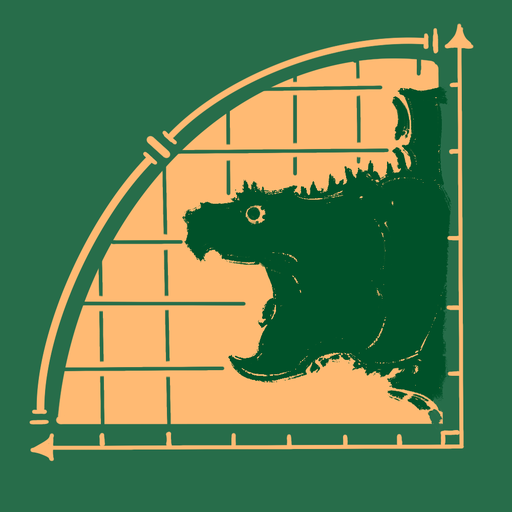

# 爬宠体型参照



依据**公开文献**整理的爬宠（龟 / 蛇 / 蜥蜴·守宫 / 蛙·蝾螈）**体型参照数据**。
输入你个体的体长、体重或年龄，看它与参照数据**差多少**。

> **它只报告偏离程度，不判断健康与否，也不构成诊断。**
> 每个物种的来源、样本量、测量口径、置信区间与局限，都写在卡片上。

## 直接下载使用

**[➜ 下载 index.html](index.html)** —— 单文件，双击就能用。

* 不需要联网、不需要安装、不需要服务器
* 手机可以发给自己再打开
* 数据全部内嵌在文件里（约 415 KB）

## 里面有什么

| | |
|---|---|
| 物种 | **52 个**（45 个有待查数据、7 个明确标注「暂无可靠数据」） |
| 曲线 | **135 条**（体长-体重 / 年龄-体长） |
| 搜索 | 中文正名、中文俗名、学名、拼音、拼音首字母 |
| 筛选 | 龟类 / 蛇类 / 蜥蜴·守宫 / 蛙·蝾螈 |
| 查询对照 | 输入体长 / 体重 / 年龄，给出各分组的参照值与偏差；可自选**测量口径**与**参照分组** |

每张卡都给出：测量口径（如 SVL 吻肛长 / SCL 直甲长）、样本量、来源文献、
拟合方程与 R²、95% 波动带、数据覆盖度，以及「需要注意」的局限。

## ⭐ 我们在公开征集数据

**如果你手上有饲养记录，欢迎提供给我们。**

我们需要的只有三样：**体长、体重、年龄**。

* 📄 [需要哪些字段 / 口径怎么量 →](docs/43_给愿意提供数据的人.md)
* 📊 [可直接填的表格模板 →](docs/43_数据模板.csv)
* ✉️ 或直接发邮件到 **yuxu446@gmail.com**

> ⚠️ **口径是这件事里最容易出错的地方**，请看上面那份说明 ——
> 同样叫「体长」，含尾和不含尾能差 8% 到 95%。写清楚是吻肛长还是全长，数据才有用。

### 征集来的数据会怎么处理

会**单独标明、列出**，与文献数据分开，不会混在一起。**对外默认不署名**，
除非提供者自己愿意；也可以随时要求删除。规则写在
[docs/42_未发表数据准入清单.md](docs/42_未发表数据准入清单.md)。

## 数据怎么来的

* 只收录**有一手数据**的记录；找不到可靠数据时**如实写「暂无可靠数据」**，不留空、不编造
* 证据分等级：L1（个体级原始数据）/ L2（有方程与样本量）/ L3（二手转引）
* **口径不混用**：吻肛长与全长是两个量，绝不互相换算（这个比值**因种而异**，球蟒约 1.08、六角恐龙约 1.95）
* 曲线只在数据覆盖范围内可靠，超出范围会在界面上标注

## 目录结构

```
index.html                       ← 离线版成品（单文件，含全部数据）
data/curves.json                 ← 权威曲线数据
data/species_meta.json           ← 物种元数据
schema/curve-card.schema.json    ← 数据格式定义
miniprogram/                     ← ⚠️ 只含离线版构建所需的 4 个共享模块
  data/curves.js                   （由 data/curves.json 生成）
  utils/calc.js                    （拟合取值 / 对照计算）
  i18n/{zh,en}.js                  （中英文案）
tools/build_miniprogram_data.py  ← 由 curves.json 生成 curves.js
tools/merge_records.py           ← 合并采集记录（含准入校验）
tools/build_offline.py           ← 构建 index.html
tools/offline/{app.js,style.css} ← 离线版前端
tools/publish_github.py          ← 发布到 GitHub
assets/                          ← 图标（多种尺寸）
docs/43_给愿意提供数据的人.md      ← 数据请求说明
docs/43_数据模板.csv              ← 可直接填的表格
docs/42_未发表数据准入清单.md      ← 未发表数据的准入规则
```

> **关于 `miniprogram/`**：这个仓库**不包含微信小程序本体**（页面、项目配置、反馈页等都不在内）。
> 保留那 4 个文件，是因为离线版就是把它们内联进 `index.html` 的 ——
> 这样离线版与别的端**共用同一份数据与同一套算法**，不会出现同一个物种两个答案。

## 自己重新构建

```bash
# 数据改动后，先重新生成共享模块
python tools/build_miniprogram_data.py

# 再重建离线单文件
python tools/build_offline.py --out .
```

## 反馈

希望增加哪个物种、或者发现哪条曲线不对：发邮件到 **yuxu446@gmail.com**，
或在 [Issues](../../issues) 里提。

## 许可与出处

曲线数据来自公开文献，每条记录的**完整出处**都写在对应卡片上。
本仓库的**代码**目前未指定开源许可证；**数据**的再使用请遵循其原始文献的条款。
